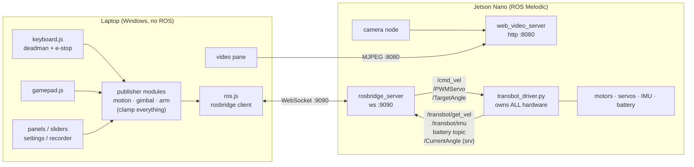

# Transbot SE Laptop Control Dashboard

A laptop-based control and telemetry web dashboard for the Yahboom Transbot SE
robot (Jetson Nano B01, ROS Melodic).

## Architecture (v1)

- **Robot (Jetson Nano):** the stock Yahboom ROS driver owns all hardware.
  `rosbridge_server` exposes ROS topics over WebSocket (port 9090) and
  `web_video_server` serves the camera as MJPEG over HTTP (port 8080).
- **Laptop:** a static web dashboard (HTML/CSS/JS + roslib.js) served locally.
  It publishes control topics and subscribes to telemetry via rosbridge, and
  embeds the MJPEG stream. No ROS install needed on the laptop.



The contract that makes this safe and extensible: **only `transbot_driver.py`
touches hardware**, and **only the publisher modules talk to the control
topics** from the laptop side. Everything else — keyboard, gamepad, panels,
and any future input — is a client of those two layers.

## Network profiles

The robot is reachable two ways, and both are first-class:

- **Home Wi-Fi (primary, used for development):** the Jetson joins the same
  Wi-Fi network as the laptop in client mode. Both devices keep internet
  access, which is required for installing packages on the robot and for
  development on the laptop.
- **Robot hotspot (fallback, for use away from any Wi-Fi):** the laptop joins
  the robot's own "transbot" access point. Fully offline operation; the laptop
  has no internet while connected.

The dashboard config holds a named profile for each network (rosbridge URL and
video URL per profile). Switching networks is a single profile selection — no
code changes. The robot-side launch is identical on both networks.

**Automatic failover (robot-side):** NetworkManager prefers home Wi-Fi
(`home_wifi`, autoconnect priority 10) over the hotspot AP (`Transbot`,
priority 0). On top of that, `wifi-failover.timer` runs
`wifi_failover.sh` every 60 s: if the robot has **no** active Wi-Fi link it
tries home Wi-Fi first (if the SSID is visible), otherwise it starts its own
hotspot — so the robot is always reachable somewhere. The check never
preempts an active link, so it can't drop a live teleop session.

Manual switching on the robot:

```bash
sudo nmcli con up home_wifi   # join home Wi-Fi
sudo nmcli con up Transbot    # start the hotspot AP
```

## Status

- [x] Phase 0 — repo + passwordless SSH to the Jetson
- [x] Phase 1 — interface discovery complete, see `FINDINGS.md`; all message
      shapes verified and config updated (camera topic `/image`, battery
      `/voltage` `{Voltage}`, IMU `/imu/data`)
- [x] Phase 2 — rosbridge-suite installed; `rosbridge-dashboard.service`
      (systemd, enabled) starts the bridge at boot, so the robot is fully
      dashboard-ready on power-on. Verified live from the laptop: telemetry,
      services, and the `/image` MJPEG stream all answer on
      ws://192.168.0.109:9090 / :8080 (home Wi-Fi profile)
- [x] Phase 3 — dashboard built and tested against the mock (which mirrors
      the verified interface)
- [x] Phase 4 — test and safety pass on the real robot complete; checklist
      and results below
- [x] Phase 5 — docs

## Quick start (real robot)

1. Power the robot on. Everything robot-side autostarts via systemd
   (driver + camera + web_video_server + rosbridge); ~2 minutes to ready.
   The OLED shows which network it landed on (home Wi-Fi, or its own
   `Transbot` hotspot when home Wi-Fi isn't reachable).
2. On the laptop: `python tools/serve_dashboard.py`, open
   http://localhost:8000, pick the matching NET profile (HOME WIFI or
   ROBOT HOTSPOT). The lamp goes green and the camera feed appears.
3. VPNs (e.g. NordVPN) must be off or configured to allow LAN traffic, or
   the link will drop.

## Running the dashboard (mock mode, no robot needed)

Two terminals from the repo root:

```powershell
# 1. mock rosbridge server (simulated driver telemetry on ws://localhost:9090)
python mock/mock_rosbridge.py

# 2. static server for the dashboard (sends no-cache headers — required so
#    browser-cached ES modules can never mix old and new code)
python tools/serve_dashboard.py
```

Open http://localhost:8000 and make sure the NET profile is `MOCK (local sim)`.
The mock logs every command the dashboard sends, simulates measured velocity
(echoing `/cmd_vel`, decaying to zero when commands stop), IMU noise, a
draining battery (to exercise the low-voltage warning), and a `/CurrentAngle`
service that follows `/TargetAngle` commands.

Protocol self-test for the mock: `python mock/selftest.py` (mock must be running).

### Key bindings (v1, also shown in the dashboard footer)

| Keys | Action |
| --- | --- |
| W / S (hold) | drive forward / back |
| A / D (hold) | rotate left / right (combinable with W/S) |
| SPACE | e-stop — immediate zero Twist, highest priority, works from any focus |
| Arrow keys | gimbal pan/tilt step, C = gimbal home (pan 90°, tilt 22°) |
| U/J, I/K, O/L | arm joints 7 / 8 / 9 step (J9 is the gripper joint) |
| H | arm home pose (J7 225°, J8 30°, J9 30°) |

The gimbal and arm panels also have a slider plus a numeric entry field per
axis (type a value and press Enter). All five axes — pan, tilt, J7, J8, and
the gripper joint J9 — are continuous; ranges come from `config.js` and every
value is clamped before publishing. Keyboard steps, sliders, and typed values
all stay in sync.

### Pose buttons

| Button | Pose | Behavior |
| --- | --- | --- |
| GIMBAL HOME | pan 90°, tilt 22° | same path as the C key |
| ARM HOME | J7 225°, J8 30°, J9 30° | all joints, including gripper |
| ARM READY | J7 110°, J8 175°, J9 30° | staged: J8 leads, J7+J9 start after ~5° of J8 travel |
| ARM STOW | J7 225°, J8 30° | gripper (J9) stays where it is — holds its grip |

Multi-joint poses send one command per joint, paced 150 ms apart (the vendor
driver drops commands that arrive back-to-back), then poll `/CurrentAngle`
once and re-send any joint more than 8° off target. Pose sequences abort on
e-stop or when superseded by another pose.

### Gamepad (standard-mapping controller, e.g. Xbox)

| Control | Action |
| --- | --- |
| Left stick | drive — analog, partial deflection = partial speed |
| Right stick | gimbal pan/tilt |
| LT / RT | gripper joint J9 close / open |
| D-pad | J7 (left/right), J8 (up/down) |
| B | e-stop (same path as spacebar) |
| A | arm home pose |

Stick release stops the robot (deadman parity with the keyboard); a
disconnecting pad sends an immediate stop. The PAD indicator in the header
lights when a controller is detected (press any button to wake it).

### Other dashboard tools

- **SETTINGS panel** — live-tune the speed caps (never above the hard driver
  limits), gimbal/arm step sizes, and arm `run_time`. Persisted across
  reloads in localStorage.
- **RTT readout** — round-trip latency over rosbridge (via `/rosapi/get_time`),
  next to the link lamp; turns amber above 250 ms.
- **Session recorder** — ● REC in the header captures every outgoing command,
  telemetry message, and service response with timestamps; SAVE downloads a
  JSONL file. This is the evidence trail for the Phase 4 safety pass.

## Phase 4 — test & safety pass (results)

Performed 2026-06-09/10 with the robot on a stand, tracks clear, against the
live robot over home Wi-Fi. All items **PASS**:

| # | Test | Result |
| --- | --- | --- |
| 1 | Drive (W/S/A/D + diagonals); CMD vs MEAS track in the DRIVE panel | PASS |
| 2 | Range clamps — out-of-range typed values clamp to configured limits | PASS |
| 3 | Deadman: key release stops the robot immediately | PASS |
| 4 | Deadman: tab blur / focus loss stops the robot | PASS |
| 5 | E-stop (SPACE) mid-drive: instant zero-Twist burst + banner, including with focus in an input field | PASS |
| 6 | Gimbal arrows/sliders/home; arm steps, sliders, HOME / READY / STOW poses with staging and verify-resend | PASS (after pacing fix — see commit history: vendor driver drops back-to-back arm commands) |
| 7 | **Stop-on-disconnect:** Wi-Fi cut mid-drive → robot stops on its own | PASS — but see the field amendment below |
| 8 | Reconnect: link restored → lamp recovers automatically; previously held keys do NOT resume motion | PASS |

**Field amendment (post-pass):** a *degrading* link (silent TCP blackhole, as
opposed to the clean socket close the test produced) did NOT stop the robot —
the driver executes the last command forever and rosbridge still believed a
client was attached. Fixed with `robot/cmd_vel_watchdog.py` (deployed into
`transbot_bringup/scripts/`, launched with the stack, respawning): if
`/cmd_vel` goes silent for 0.5 s while the last command was non-zero, it
publishes a zero-Twist burst. Normal 10 Hz driving never triggers it. This
watchdog protects against link degradation, browser crashes, and laptop
sleep — independent of the dashboard.

Notes from testing: gimbal pan stepping was direction-inverted on the real
robot (fixed via `invertStep` config); the factory app held the camera
exclusively (replaced by our own stack, see below); multi-joint arm commands
needed pacing + verification to be reliable.

## Robot-day tooling (Phases 0–2, prepared in advance)

```powershell
.\tools\setup_ssh.ps1     -JetsonIp <ip> -User <user>  # Phase 0: key install + verify
.\tools\run_discovery.ps1 -JetsonIp <ip> -User <user>  # Phase 1: read-only discovery
.\tools\deploy_robot.ps1  -JetsonIp <ip> -User <user>  # Phase 2: push launch + start script
```

`robot/transbot_dashboard.launch` starts the driver bringup, rosbridge
(:9090), and web_video_server (:8080) together; `robot/start_dashboard.sh` is
the one-command robot-side entry point. Package installs on the robot are
deliberately not scripted — they happen only after an explicit go-ahead.

## Config reference (`dashboard/js/config.js`)

Everything tunable lives in one module. Entries marked **TO-VERIFY** are
vendor-doc hints that Phase 1 discovery will confirm or correct; all code
reads them from config, so fixes land in one place.

| Block | Holds | Notes |
| --- | --- | --- |
| `PROFILES` | rosbridge + video URL per network | `mock`, `home` (192.168.1.11), `hotspot` (IP TO-VERIFY) |
| `TOPICS` | name + message type per topic | `/cmd_vel` verified (ROS standard); `/PWMServo`, `/TargetAngle`, telemetry topics TO-VERIFY |
| `SERVICES` | `/CurrentAngle` (TO-VERIFY), `/rosapi/get_time` | latter ships with rosbridge |
| `MOTION` | `hardMax` (driver limits, never exceeded) and `cap` (operating limit) per axis | caps are live-tunable in SETTINGS, clamped to `hardMax` |
| `GIMBAL` / `ARM` | servo ids, ranges, home angles (operator-tuned), step sizes, `invertStep` per axis, arm `run_time`, `interCommandMs` + `verifyToleranceDeg` (pose pacing/repair), `readyPose` (staged deploy) | verified on the robot |
| `POWER` | low-voltage warning threshold | 9.9 V for the 3S pack, TO-VERIFY |
| `KEYS` | every key binding (`event.code` values) | legend renders from this, so docs can't drift |
| `GAMEPAD` | deadzone, rates, button mapping | standard-mapping layout |
| `TELEMETRY` / `RECONNECT` | poll intervals, staleness window, backoff | — |

Message-shape assumptions for the two custom topics are isolated in
`buildPwmServoMessage()` (gimbal.js) and `buildArmMessage()` (arm.js) — the
only two functions to edit after discovery.

## Extending this

The dashboard is deliberately just *one publisher among potential many*. The
driver doesn't know or care who publishes; anything that writes valid,
range-clamped messages to the control topics drives the robot identically.

**Topic contract (verify exact types against `FINDINGS.md` after Phase 1):**

| Topic | Type | Carries |
| --- | --- | --- |
| `/cmd_vel` | `geometry_msgs/Twist` | `linear.x` m/s, `angular.z` rad/s |
| `/PWMServo` | custom (TO-VERIFY) | gimbal servo id (1=pan, 2=tilt) + angle 0–180° |
| `/TargetAngle` | custom (TO-VERIFY) | arm joint id (7/8/9) + angle + `run_time` ms |

**An AI behavior node** (e.g. person-following, line tracking) should run on
the Jetson as a native ROS node (rospy/roscpp) and publish the topics above
directly — no rosbridge hop, lowest latency. It can subscribe to the same
telemetry (`/transbot/get_vel`, IMU, camera) the dashboard uses. The dashboard
keeps working as a monitor while the node drives; the spacebar e-stop still
publishes zero Twists, but note ROS does not arbitrate between publishers —
a safety-minded behavior node should subscribe to a mute/e-stop signal or be
stopped before manual override matters.

**An external arm-teleoperation device** (the encoder glove idea) has two
clean integration points:

1. *Through the dashboard (quickest):* feed device readings to
   `setArmJoint('j7'|'j8'|'j9', angleDeg)` and `setGimbalX/Y()` — e.g. from a
   small WebSocket/serial bridge page-side. Clamping, `run_time`, and the
   recorder come for free, exactly like the gamepad integration did.
2. *As its own publisher:* a standalone process (any language) connects to
   `ws://<jetson>:9090` with a rosbridge client (roslibpy, roslibjs) — or runs
   as a native ROS node on the Jetson — and publishes `/TargetAngle` itself.
   It must then own its safety duties: clamp to the discovered ranges, send a
   moderate `run_time`, and stop publishing on sensor dropout.

**Rules for any new publisher:** clamp every value to the discovered ranges,
never touch flash/persistent servo parameters, include `run_time` on arm
moves, and implement deadman behavior — if your input source dies, your last
command must be a stop (zero Twist) or a hold (arm).

Deadman behavior: motion stops on key release, on tab blur or page hide, and
on rosbridge disconnect.

See `transbot_dashboard_build_prompt.md` for the full build brief.
